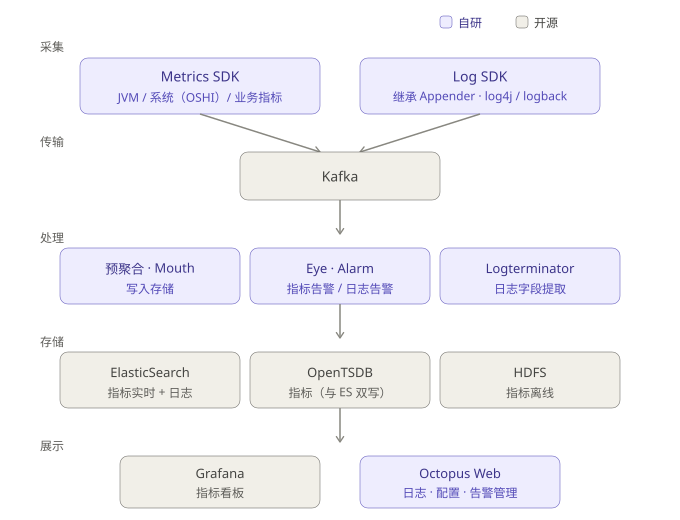
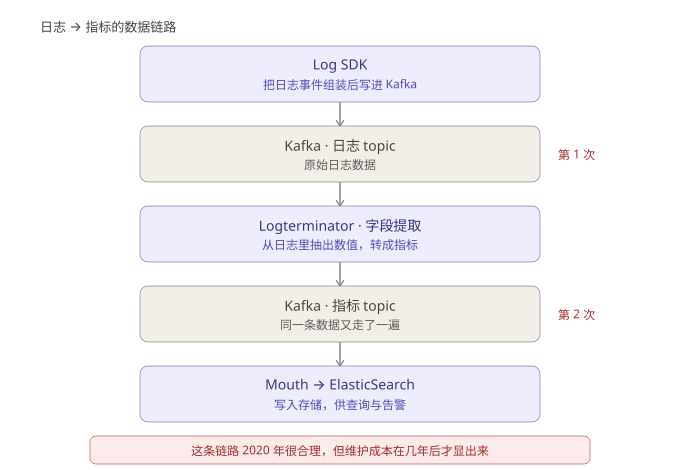

# 第一代监控平台：我们当时看不见调用链

## 一、2019 年，我们要解决的问题

2019 年，我在做一个监控平台。它服务的是**一家券商的 APM 平台**。

这个背景决定了后面很多选择。金融场景对可用性和数据可控性的要求和互联网公司不一样：数据不能出域，系统不能长时间不可用，变更窗口很小。

问题定义很简单：**把数据采上来，出问题能告警。**

数据只有两种——日志和指标。调用链不在讨论范围内，不是评估后决定不做，是它根本没出现在需求里。

团队 10 人左右，我前后端都写，SDK 也写。

当时的认知里，"监控"就等于"采集 + 告警 + 看板"。日志用来查问题，指标用来看趋势和配告警。这两件事做完，一个监控平台就算立住了。

---

## 二、架构：采集 → Kafka → 自研消费者 → 存储

这里先说一个容易被误解的点：**这个平台的"自研"指的是采集 SDK 和平台应用层，底层全部是开源组件**——Kafka、ElasticSearch、OpenTSDB、HDFS、Grafana、Redis、MySQL。图上紫色是自研，灰色是开源，边界一目了然。

所以问题不是"为什么不用开源"，而是：**为什么底层用开源，上层自己写？**

原因不复杂：底层是通用能力，开源已经足够成熟；上层要和自己的数据模型、告警规则、业务语义绑定，没有现成方案能直接对上。

---

## 三、采集侧：SDK 是怎么做的

### 日志采集：继承 Appender

三种日志框架：log4j、logback（以及 log4j2）。

它们都有一个共同点——**Appender**，也就是日志输出目的地。日志框架本身就允许你插入自定义 Appender。

所以 Log SDK 的做法是：**继承 Appender，拿到日志事件，组装成平台的数据格式，直接写 Kafka。**

不用改业务代码，业务方只需要改一行日志配置。

这个设计在当时是合适的：接入成本低，业务方不用学新东西，日志框架的扩展点本来就是为这种场景留的。

### 指标采集：分两类

**第一类：JVM 与系统指标**
- JVM 相关（堆、GC、线程等）：从 JDK 自带的方法取
- 主机系统信息：用 OSHI 采集

这里有个实际教训。

OSHI 是跨平台系统信息采集库，用起来很方便，一行代码就能拿到 CPU、内存、磁盘、网络。但它的开销比预期大得多——**最高的时候能把 CPU 打到 100%**。

被监控的应用，先被监控组件自己拖垮了。

后来我们对这块做了限制：降低采集频率、加缓存、只保留必要的字段。

**第二类：业务指标**
- 平台自己提供一套 Java API，业务方在代码里主动写指标
- SDK 在本地保存，**每 3 秒批量提交到 Kafka**

3 秒这个间隔是权衡的结果：更短则网络和 Kafka 压力大，更长则告警延迟明显。

---

## 四、存储：ES 和 OpenTSDB 双写

指标同时写 ElasticSearch 和 OpenTSDB，查询时两个都查。

为什么两个都要？

**不是为了功能互补，是为了容错。** ES 出问题可以从 TSDB 查，TSDB 出问题可以从 ES 查。

这个理由现在看有点朴素，但它反映的是当时真实的约束：**平台上线后要保证随时能查，不允许有一个存储挂掉就完全失能。**

代价也直接：
- 双写意味着双倍的写入压力和存储成本
- 两个存储的查询语法、聚合能力、数据模型都不一样，查询层要处理差异
- 两边数据不一致时，以谁为准？这是运维上长期的麻烦

用"冗余"换"可用性"，这个选择本身没错，但它把复杂度永久留在了系统里。

---

## 五、日志转指标：一个当时很自然、后来很重的设计

这是整个架构里最值得说的部分。

**日志过两次 Kafka。**

原因：日志里承载了关键的业务数据。当时指标采集能力不足，很多业务关心的数值是从日志里打出来的。所以平台从日志中提取字段，转成指标，再走指标的链路存储。

在 2020 年，这个做法是合理的——它用最小的改造成本，把已经存在的日志数据变成了可聚合的指标。

但它的代价在几年后才显现：

- **链路长**：日志延迟直接影响指标延迟
- **成本高**：同一条数据在 Kafka 里走两遍，处理资源翻倍
- **口径混乱**：一个数值既有日志版本又指标版本，排查问题时以哪个为准
- **耦合**：日志格式一改，指标提取逻辑就要跟着改

这本质上是一个**临时方案演变成长期负担**的案例。

后来 OpenTelemetry 把指标、日志、链路定义为三种独立信号，各自有独立的采集与传输路径——解决的正是这类问题。但在 2020 年，我们还没有这个视角。

---

## 六、缺席的调用链

回到最开始的问题：为什么没有调用链？

**因为没意识到它重要。**

当时的注意力全部在"把数据采上来"这件事上。采集本身就有大量工作：SDK 要适配框架、要压性能开销、要保证不丢数据、要处理各种环境和网络问题。团队精力都在这里。

而且更关键的是：**当时没有一种问题逼着我们要调用链。**

日志能回答"发生了什么"，指标能回答"整体趋势如何"。在业务规模还没起来、调用关系还不复杂的阶段，这两个足够覆盖大部分场景。

调用链要回答的是第三种问题：「**这一个请求，慢在哪一步？**」

这个问题在 2020 年还没有频繁到让我们必须解决它。

---

## 七、转折：不是顿悟，是被业务逼出来的

如果要说什么时候开始意识到调用链重要——**没有一个清晰的时刻**。

当时很懵懂。真实的过程是：业务方的问题越来越答不上来。

- "这个接口为什么慢？" —— 指标能看到它慢，看不到慢在哪个环节
- "这次故障影响哪些业务？" —— 日志能查到报错，串不起完整的调用路径
- "是不是下游拖慢了上游？" —— 没有跨服务的上下文，只能靠猜

**日志和指标回答不了这类问题。**

于是开始做评估。这是我第一次真正系统地看开源方案——之前做监控平台时，压根没有做过方案评估，自研是默认路径。

评估的结果是引入 APM 与调用链能力。回头看不复杂，但在当时，"技术需要升级了"这个判断本身就是认知上的一次突破：**承认现有方案有结构性缺陷，而不只是功能缺失。**

---

## 八、后来的事

当时没觉得这套架构有什么问题。

上线之后主要的工作是加采集项、调告警阈值、处理业务方的接入问题。平台一直跑着，双机房也没出过要切流的大事故。

问题是在后面几年才显出来的。

调用链是最大的缺失。补的时候不只是加一个模块——数据模型要重新设计，SDK 要加新的埋点能力，存储要换，查询层要重写。原来日志和指标那一套，基本用不上。

日志转指标那条链路后来一直在维护。新的日志格式出来，提取规则就要跟着改。这些年它一直在跑，也一直在改。

ES 和 OpenTSDB 双写也保留着，两边数据偶尔对不上，需要人工核对。

有三样东西留了下来，后面几代产品还在用：Log SDK 用 Appender 扩展点接入的思路、3 秒批量上报的节奏、本地缓冲和采样的机制。

关于自研这件事，当时没觉得它是个需要讨论的问题。业务方要什么，我们就写什么。技术选型这四个字，是到做下一代的时候才开始认真对待的。

---

_后续：第二代——APM 与调用链，第一次认真做技术评估，以及补上调用链的代价。_
