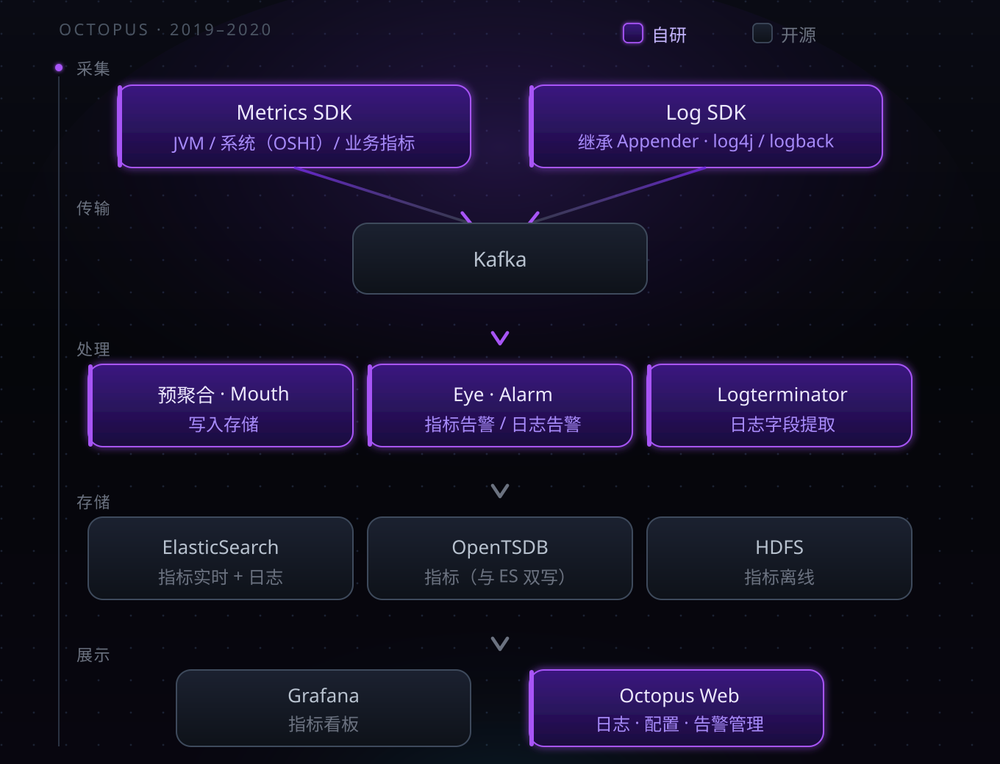
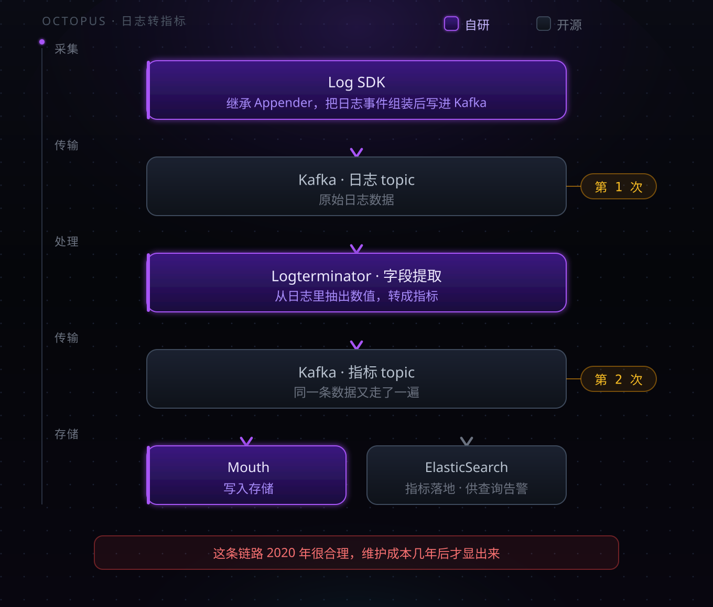

# 日志和指标都有了，就是看不见慢在哪

> 第一代监控平台回顾（2019–2020）

## 一、那时候我们以为，监控就是采集加告警

2019 年，我在写一个监控平台的第一个 SDK。

我们对自己的定位非常明确：**把数据采上来，出了问题能告警**。

数据只有两种——日志和指标。调用链？没在讨论范围内。不是评估后决定不做，是它根本没出现在需求里。

平台的用户是一家券商。金融场景的约束和互联网公司不一样：数据不能出域，系统不能长时间不可用，变更窗口很小。这几条约束，决定了后面很多选择。

团队 10 人左右。后端、SDK、前端，我都写。

---

## 二、整套架子长什么样

先说一个容易被误解的地方。

**这套系统的"自研"，指的是采集 SDK 和平台应用层。底层全部是开源组件**——Kafka、ElasticSearch、OpenTSDB、HDFS、Grafana、Redis、MySQL。

图上紫色是自研，灰色是开源。边界一目了然。

所以真正的问题不是"为什么不用开源"，而是：**为什么底层用开源，上层自己写？**

道理不复杂。底层是通用能力，开源已经足够成熟；上层要跟自己的数据模型、告警规则、业务语义绑在一起，没有现成的东西能直接对上。

---

## 三、埋点：让业务方只改一行配置

### 日志：继承 Appender

三种日志框架，log4j、logback、log4j2。

它们有一个共同点：**Appender** —— 日志的输出目的地。框架本身就把这个位置留给了扩展。

所以 Log SDK 的做法很直接：继承 Appender，拿到日志事件，组装成平台的数据格式，写进 Kafka。

业务方不用改代码，只改一行日志配置。

在当时这是最合适的做法：接入成本低，业务方不用学新东西，而这个扩展点本来就是为这种场景设计的。

### 指标：两条路

**第一条，JVM 和系统指标。**

JVM 相关的（堆、GC、线程）从 JDK 自带的方法取。主机系统信息，用 OSHI 采集。

这里有个实际教训。

> OSHI 是跨平台系统信息采集库，一行代码就能拿到 CPU、内存、磁盘、网络。但它的开销比预期大得多——**最高的时候能把 CPU 打到 100%**。
>
> 被监控的应用，先被监控组件自己拖垮了。

后来我们对这块做了限制：降低采集频率、加缓存、只保留必要的字段。

**第二条，业务指标。**

平台提供一套 Java API，业务方在代码里主动写指标。SDK 在本地攒着，**每 3 秒批量提交到 Kafka**。

3 秒是权衡的结果。更短，网络和 Kafka 压力大；更长，告警延迟明显。

---

## 四、同一份数据，存两个数据库

指标同时写 ElasticSearch 和 OpenTSDB，查询的时候两个都查。

为什么两个都要？

**不是为了功能互补，是为了容错。** ES 出问题可以从 TSDB 查，TSDB 出问题可以从 ES 查。

这个理由现在听起来有点朴素，但它反映的是当时真实的约束：**平台上线之后必须随时能查，不允许一个存储挂掉就彻底失能。**

代价也很直接：

- 双倍的写入压力和存储成本
- 两个库的查询语法、聚合能力、数据模型都不一样，查询层要抹平差异
- 两边数据对不上时，以谁为准？这是运维上长期的麻烦

用冗余换可用性，这个选择没错。但它把复杂度永久地留在了系统里。

---

## 五、从日志里榨指标

这是整套架构里最值得说的地方。

**同一条数据，在 Kafka 里走了两遍。**

原因很现实：日志里承载了关键业务数据。当时指标采集能力不足，很多业务关心的数值是从日志里打出来的。所以平台从日志中提取字段，转成指标，再走指标的链路存下来。

在 2020 年，这个做法是合理的——它用最小的改造成本，把已经存在的日志数据变成了可聚合的指标。

代价在几年后才显现：

- **链路长**：日志延迟直接影响指标延迟
- **成本翻倍**：同一条数据在 Kafka 里走两遍，处理资源也是两遍
- **口径混乱**：一个数值既有日志版本又指标版本，排查问题时以哪个为准
- **强耦合**：日志格式一改，指标提取规则就得跟着改

这是一个典型的**临时方案演变成长期负担**的案例。

后来 OpenTelemetry 把指标、日志、链路定义成三种独立信号，各有各的采集与传输路径——解决的正是这类问题。但在 2020 年，我们还没有这个视角。

---

## 六、那个不在场的东西

回到最开始的问题：为什么没有调用链？

**因为没意识到它重要。**

当时的注意力全在"把数据采上来"这件事上。光采集就有大量工作：SDK 要适配各种框架、要压性能开销、要保证不丢数据、要处理五花八门的环境和网络问题。

更关键的是：**当时没有一种问题，逼着我们要调用链。**

日志能回答"发生了什么"，指标能回答"整体趋势如何"。在业务规模还没起来、调用关系还不复杂的阶段，这两个够用了。

调用链要回答的是第三种问题：

> 这一个请求，慢在哪一步？

2020 年，这个问题还没频繁到非解决不可。

---

## 七、答不上来的问题

如果问我什么时候开始意识到调用链重要——

**没有那个时刻。**

当时很懵懂。真实的过程是：业务方的问题，越来越答不上来。

- "这个接口为什么慢？" —— 指标能看到它慢，看不到慢在哪一环
- "这次故障影响了哪些业务？" —— 日志能查到报错，串不起完整的调用路径
- "是不是下游拖慢了上游？" —— 没有跨服务的上下文，只能靠猜

**日志和指标回答不了这类问题。**

于是开始做评估。这是我第一次真正系统地看开源方案——之前做监控平台的时候，压根没做过方案评估，自研是默认路径。

评估的结果，是引入 APM 和调用链能力。现在回头看这一步不复杂，但在当时，"技术需要升级了"这个判断本身就是一次认知上的突破：**承认现有方案有结构性缺陷，而不只是功能不够。**

---

## 八、后来

当时没觉得这套架构有什么问题。

上线之后主要的工作是加采集项、调告警阈值、处理业务方的接入问题。平台一直跑着，双机房也没出过要切流的大事故。

问题是在后面几年才显出来的。

调用链是最大的缺失。补的时候不只是加一个模块——数据模型要重新设计，SDK 要加新的埋点能力，存储要换，查询层要重写。原来日志和指标那一套，基本用不上。

日志转指标那条链路后来一直在维护。新的日志格式出来，提取规则就要跟着改。这些年它一直在跑，也一直在改。

ES 和 OpenTSDB 双写保留着，两边数据偶尔对不上，需要人工核对。

有三样东西留了下来，后面几代产品还在用：Log SDK 用 Appender 扩展点接入的思路、3 秒批量上报的节奏、本地缓冲和采样的机制。

关于自研这件事，当时没觉得它是个需要讨论的问题。业务方要什么，我们就写什么。技术选型这四个字，是到做下一代的时候才开始认真对待的。

---

_下一篇：第二代——APM 与调用链，第一次认真做技术评估，以及补上调用链的代价。_
